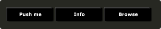

# Button (File button)

A filebutton can be used to select files from disk. The filename selected, or created will be sent to Csound on the named channel as a string message. Filebuttons can also be used to select snapshot files for Cabbage to save parameter presets. See the populate identifier below. 

```csharp
filebutton bounds(x, y, width, height), channel("chan"), \
text("offCaption"), populate("filetype", "dir"), value(val), \
colour("colour"), fontcolour("colour"), identchannel("channel"), \
alpha(val), visible(val), mode("mode"), rotate(radians, pivotx, pivoty), \
widgetarray("chan", number), popuptext("text"), active(val), svgfile("type", "file")
```
<!--(End of syntax)/-->

##Identifiers

### Specific Identifiers





### Common Identifiers































<!--(End of identifiers)/-->
>colour:1() and fontcolour:1() can be set using colour() and fontcolour(). However, it's recommended that you use the numerated colour identifiers in order to make your code as readable a possible. 

##Example
```csharp
<Cabbage>
form size(400, 500), caption("Untitled"), pluginID("plu1"), colour(39, 40, 34)
button bounds(20, 16, 100, 30), channel("button"),  text("Push me"), fontcolour("white")
infobutton bounds(120, 16, 100, 30), channel("button"),  file("README.txt"), text("Info")
filebutton bounds(220, 16, 100, 30), channel("button"),  populate("*.wav", ""), text("Browse")
</Cabbage>
```


