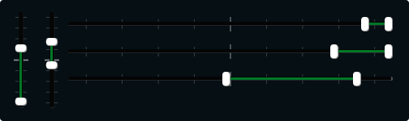

# vrange

Create an on-screen slider with a dragable, and user selectable range. Data can be sent to Csound on the channel specified through the channel string.  


```csharp
vrange bounds(x, y, width, height), channel("chan"), \
text("name"), textbox(val), range(min, max, value, skew, incr), \
min(val), max(val), textcolour("colour"), fontcolour("colour"), \
trackercolour("colour"), outlinecolour("colour"), trackerthickness(val)
identchannel("channel"), alpha(val), visible(val), caption("caption"), \
rotate(radians, pivotx, pivoty), widgetarray("chan", number), popuptext("text") \
active(val)
```
<!--(End of syntax)/-->

##Identifiers

### Specific Identifiers

  



 















### Common Identifiers










  









 
 
<!--(End of identifiers)/-->

>Make sure to use two unique channel names when using hslider2 and vslider2, otherwise min and max will be set to the same value. 

##Example

```csharp
<Cabbage>
form caption("Test") size(615, 480), pluginID("add1"), guirefresh(1) 
hrange bounds(92, 16, 400, 30), channel("rangeone1", "rangetwo1"), range(-2000, 100, -100:100, 1, .001)
hrange bounds(92, 50, 400, 30), channel("rangeone2", "rangetwo2"), range(-2000, 100, -300:200, 1, .001)
vrange bounds(16, 16, 36, 119), channel("vrange1", "vrange2"), range(0, 300, 10:200, 1, 1)
hrange bounds(92, 84, 400, 30) channel("rangeone2", "rangetwo2"), range(-2000, 100, -1000:-100, 1, .001)
vrange bounds(54, 16, 36, 119), channel("vrange1", "vrange2"), range(0, 300, 0:100, 1, 1)
</Cabbage>
```


