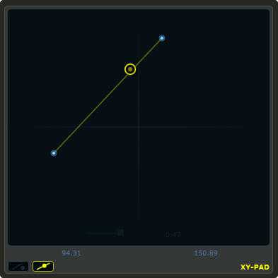

# XY Pad

xypad is an x/y controller that sends data to Csound on two named channels. The first channel transmits the current position of the ball on the X axis, while the second transmits the position of the ball on the Y axis. The XY pad can function in two unique modes of automation, free and path based. The two modes can be toggled by clicking on the corresponding icon on the bottom left of the xypad control. With either mode selected you can right-click the xypad and create a trajectory or path for the circle's movement. Release the mouse and the circle will start moving. Once the ball is in full flight you can control the speed of the ball using the XY pad slider that will appear once you hover over it with the mouse. To stop the ball simple left click anywhere on the xy pad canvas with the left mouse button. 


```csharp
xypad bounds(x, y, width, height), channel("chan1", "chan2"), \
rangex(min, max, val), rangey(min, max, val), text("name"), \
identchannel("channel"), colour("colour"), fontcolour("colour"), \
textcolour("colour"), alpha(val), visible(val), widgetarray("chan", number) \
active(val)
```
<!--(End of syntax)/-->

##Identifiers
### Specific Identifiers





**rangex(min, max, value)** sets the range of the X axis. The first 2 parameters are required. The third is optional. The first two parameters let you set the minimum value and the maximum value. The next parameter determines the initial value. 

**rangey(min, max, value)** sets the range of the Y axis. The first 2 parameters are required. The third is optional. The first two parameters let you set the minimum value and the maximum value. The next parameter determines the initial value. 



### Common Identifiers



 

 

  

  

  

 

  

 

> XY pads range identifiers do not permit the setting of skew factors, or increments. If you wish to set a custom skew factor, or increment value, you will need to do so using Csound code.  


<!--(End of identifiers)/-->

##Example:

```csharp
<Cabbage>
form size(400, 500), caption("Untitled"), pluginID("plu1"), colour(39, 40, 34)
xypad bounds(10, 10, 380, 380), channel("x", "y"), colour("yellow"), textcolour("yellow"), text("XY-PAD")
</Cabbage>
```

