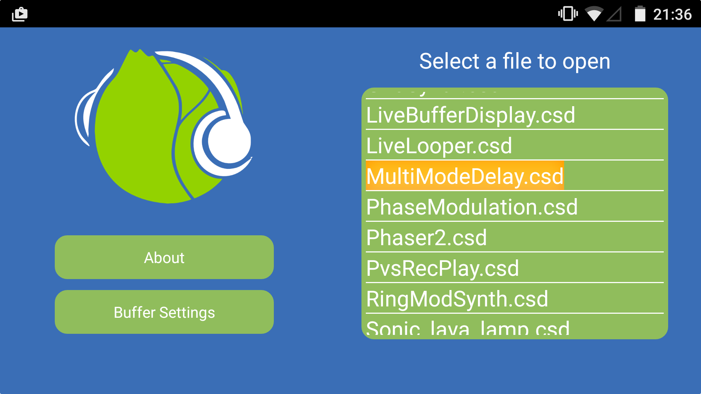

# Cabbage on Android

Cabbage for Android will run any Cabbage plugin or desktop instrument directly on one's smart phone. In order to load a Cabbage file, you must place it into the *CabbageFiles* folder created by the Cabbage app in your home directory. When the app is launched, it checks this user directory for all .csd files and adds them to the list of Cabbage files available. 



### Making your instruments more Android friendly

Although the Cabbage app can load just about any Cabbage instrument, it might be worth keeping in mind a few little things when porting instruments. The first caveat is that all instruments on Android load in landscape orientation. If you have an instrument whose height is greater than its width, it's going to look quite strange. 

Cabbage on Android will try to automatically resize an instrument to best fit the phone's screen resolution. It does this by checking the screen's width and height against the plugin's width and height. If the plugin's width is set to 600 pixels, and the screen has a width of 1200 pixels, all widgets will be scaled upwards by a factor of 2. The rescaling is not always perfect, therefore it's always best to develop your instruments using one of the more common aspect ratios such as 4:3, 16:10, 3:2, 5:3, 16:9.

> The fact that Cabbage on Android dynamically rescales instruments may result in some unexpected behavior when it comes to moving widgets around the screen with [Identifier channels](./identchannels.md). For this reason it is always best to use the $SCREEN macros so that you can proportionally reposition widgets based on the handset's screen size.   

It seems that most Android devices take a single input stream rather than a stereo one. This means that many of the examples that ship with Cabbage may suddenly appear as mono instead of stereo. To ensure that instruments run in stereo, simply patch the input stream to both the left and right channel variables. For example:

```csharp
aInL inch 1
aInR inch 1
```

Finally, it is always worth keeping in mind that Android devices will perform slower than desktops. It may be necessary to modify your instruments so they run more efficiently on Android. The simplest way to do this is to increase the number of samples in each control cycle. You can do this be increasing the *ksmps* in the Csound header section.  

### Buffer settings

Cabbage on Android allows users to choose between 3 buffer sizes. The sizes will depend on your device, but Cabbage will let you choose between the largest, smallest and medium sized buffer. Smaller buffer sizes will result in less latency but may cause some audio drop outs. The chosen buffer size is saved and used for any future sessions.


  
