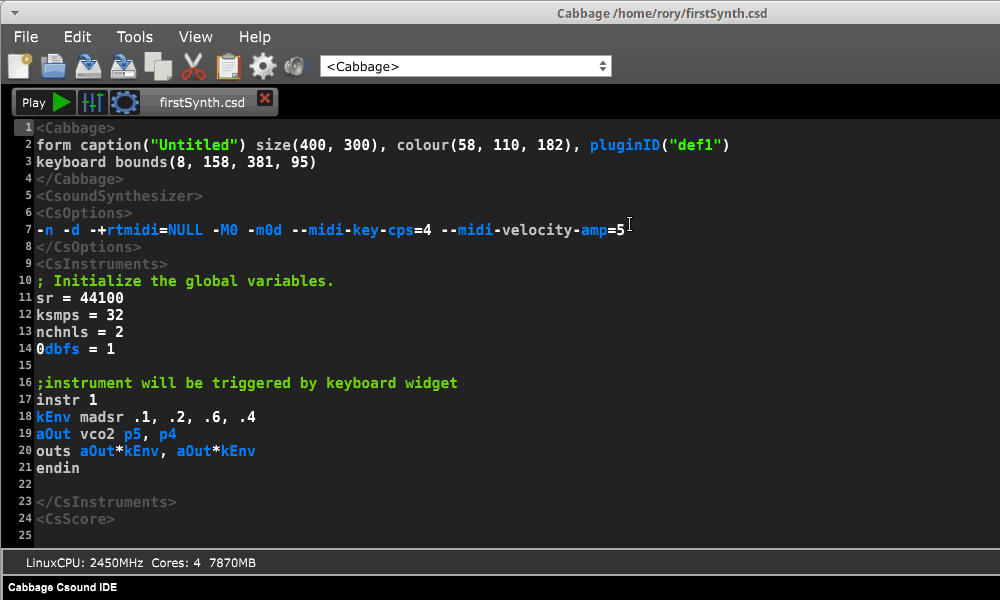
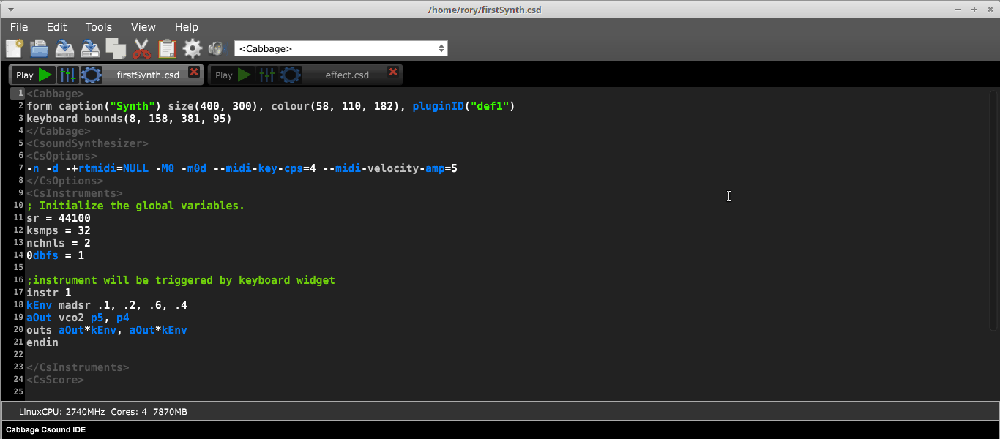

# Modifiying the audio graph

The Cabbage patcher provides users with the means of accessing and modifying the digital audio graph. A digital audio graph consists of nodes and connections. Each node is an instrument, either a synth, or an effect. And each will contain audio and MIDI inputs and outputs.

Each time you run an instrument in Cabbage it will automatically be added to the graph. In the following example we compile a basic instrument and then show the underlying audio-graph by launching the Cabbage patcher window. 

As you can see in the above image, Cabbage connects each output to the Audio Output node, and each input is also connected. A default MIDI connection is also made. Each instrument that is running in Cabbage will have an associated node in the audio graph. You can modifiy the connections, and save them as Cabbage patches whenever you like. In the next example, we open the simple effect from the previous page. We can then modify the graph so that the output of our simple synth goes through the effect, before being output the computer's sound card. 

> While the Cabbage patcher can be used to create complex and intricate processing chains it is not intended to be used to create low-level nodes. For example, it might be tempting to create a single oscil instrument, along with simple mathematical operator instruments in the style of Pure Data, or Max/MSP. Doing so is a simply waste of resources.    