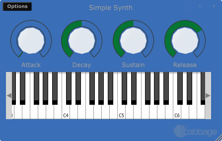
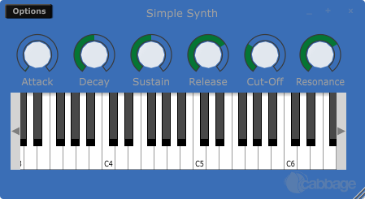

# Beginner Synth

As mentioned in the opening page of this beginner's section, each Cabbage instrument is defined in a simple text file with a .csd extension. The syntax used to create GUI widgets is quite straightforward and should be provided within special xml-style tags <Cabbage> and </Cabbage> which can appear either above or below Csound's own <CsoundSynthesizer> tags. Each line of Cabbage specific code relates to one GUI widget only. The attributes of each widget are set using different identifiers such as colour(), channel(), size() etc. Where identifiers are not used, Cabbage will use the default values. Long lines can be broken up with a '\' placed at the end of a line. 

Each and every Cabbage widget has 4 common parameters: position on screen(x, y) and size(width, height). Apart from position and size all other parameters are optional and if left out default values will be assigned. To set widget parameters you will need to use an appropriate identifier after the widget name. More information on the various widgets and identifiers available in Cabbage can be found in the Widget reference section of these docs.

### Getting started.

Now that the basics of the Csound language have been outlined, let's create a simple instrument. The opcodes used in this simple walk through are vco2, madsr, moogladder and out.

The vco2 opcode models a voltage controlled oscillator. It provides users with an effective way of generating band-limited waveforms and can be the building blocks of many a synthesiser. Its syntax, taken from the Csound [reference](https://csound.github.io/docs/manual/vco2.html) manual, is given below. It is important to become au fait with the way opcodes are presented in the Csound reference manual. It, along with the the Cabbage widget reference are two documents that you will end up referencing time and time again as you start developing Cabbage instruments.  
```csharp
ares vco2 kamp, kcps [, imode] [, kpw] [, kphs] [, inyx]
```
**vco2** outputs an a-rate signal and accepts several different input argument. The types of input parameters are given by the first letter in their names. We see above that the kamp argument needs to be k-rate. Square brackets around an input argument means that argument is optional and can be left out. Although not seen above, whenever an input argument start with 'x', it can be an i, k or a-rate variable. 

*kamp* determines the amplitude of the signal, while *kcps* set the frequency of the signal. The default type of waveform created by a **vco2** is a sawtooth waveform. The simplest instrument that can be written to use a **vco2** is given below. The **out** opcode is used to output an a-rate signal as audio.

```csharp
instr 1
aOut vco2 1, 440
out aOut
endin
```
In the traditional Csound context, we would start this instrument using a 'score statement'. We'll learn about score statements later, but because we are building a synthesiser that will be played with a MIDI keyboard, our score section will not be very complex. In fact, it will only contain one line of code. *f0 z* is a special score statement that instructs Csound to listen for events for an extremely long time. Below is the entire source code, including a simple Cabbage section for the instrument presented above.

```csharp
<Cabbage>
form caption("Untitled") size(400, 300), colour(58, 110, 182), pluginID("def1")
keyboard bounds(8, 158, 381, 95)
</Cabbage>
<CsoundSynthesizer>
<CsOptions>
-+rtmidi=NULL -M0 -m0d --midi-key-cps=4 --midi-velocity-amp=5
</CsOptions>
<CsInstruments>
; Initialize the global variables. 
sr = 44100
ksmps = 32
nchnls = 2
0dbfs = 1

;instrument will be triggered by keyboard widget
instr 1
iFreq = p4
iAmp = p5
aOut vco2 iAmp, iFreq
outs aOut, aOut
endin

</CsInstruments>
<CsScore>
;causes Csound to run for about 7000 years...
f0 z
</CsScore>
</CsoundSynthesizer>
```   

You'll notice that the pitch and frequency for the **vco2** opcode has been replaced with two *i*-rate variables, *iFreq* and *iAmp*, who in turn get their value from *p5*, and *p4*. *p5* and *p4* are p-variables. Their values will be assigned based on incoming MIDI data. If you look at the code in the <CsOptions> section you'll see the text '--midi-key-cps=4 --midi-velocity-amp=5'. This instructs Csound to pass the current note's velocity to *p5*, and the current note's frequency, in cycle per second(Hz.) to *p4*. *p4* and *p5* were chosen arbitrarily. *p7*, *p8*, *p*-whatever could have been used, so long as we accessed those same *p* variables in our instrument.

Another important piece of text from the <CsOptions> section is the '*-M0*'. This tells Csound to send MIDI data to our instruments. Whenever a note is pressed using the on-screen MIDI keyboard, or a hardware keyboard if one is connected, it will trigger instrument 1 to play. Not only will it trigger instrument one to play, it will also pass the current note's amplitude and frequency to our two *p* variables. 

### Don't be a click head!

If you've tried out the instrument above you'll notice the notes will click each time they sound. To avoid this, an amplitude envelope should be applied to the output signal. The most common envelope is the ubiquitous ADSR envelope. ADSR stands for Attack, Decay, Sustain and Release. The attack, decay and sustain sections are given in seconds as they relate to time values. The sustain value describes the sustain level which kicks in after the attack and decay times have passed. The note's amplitude will rest at this sustain level until it is released.


Csound offers several ADSR envelopes. The simplest one to use, and the one that will work out of the box with MIDI based instruments is **madsr** Its syntax, as listed in the Csound [reference](https://csound.github.io/docs/manual/madsr.html) manual, is given as:

```csharp
kres madsr iatt, idec, islev, irel
```
Note that the inputs to madsr are *i*-rate. They cannot change over the duration of a note. There are several places in the instrument code where the output of this opcode can be used. It could be applied directly to the first input argument of the vco2 opcode, or it can be placed in the line with the out opcode. Both are valid approaches. 

```csharp
<Cabbage>
form caption("Untitled") size(400, 300), colour(58, 110, 182), pluginID("def1")
keyboard bounds(8, 158, 381, 95)
</Cabbage>
<CsoundSynthesizer>
<CsOptions>
-n -d -+rtmidi=NULL -M0 -m0d --midi-key-cps=4 --midi-velocity-amp=5
</CsOptions>
<CsInstruments>
; Initialize the global variables. 
sr = 44100
ksmps = 32
nchnls = 2
0dbfs = 1

;instrument will be triggered by keyboard widget
instr 1
iFreq = p4
iAmp = p5
iAtt = 0.1
iDec = 0.4
iSus = 0.6
iRel = 0.7
kEnv madsr iAtt, iDec, iSus, iRel 
aOut vco2 iAmp, iFreq
outs aOut*kEnv, aOut*kEnv
endin

</CsInstruments>
<CsScore>
;causes Csound to run for about 7000 years...
f0 z
</CsScore>
</CsoundSynthesizer>
```

### Controlling ADSR parameters.

The values of the ADSR parameters can be set using widgets. A typical widget for such control is a slider of some sort. They all behave in more or less the same way. Their job is to send numbers to Csound on a fixed channel. Each widget that is capable of controlling some aspect of an instrument must have a channel set using the **channel()** identifier. In the following code 4 rslider are created. Each one has a unique **channel()** set, and they all have the same range. More details on sliders can be found in the widget reference section.

```csharp
<Cabbage>
form caption("Simple Synth") size(450, 260), colour(58, 110, 182), pluginID("def1")
keyboard bounds(14, 120, 413, 95)
rslider bounds(12, 14, 105, 101), channel("att"), range(0, 1, 0.01, 1, .01), text("Attack")
rslider bounds(114, 14, 105, 101), channel("dec"), range(0, 1, 0.5, 1, .01), text("Decay")
rslider bounds(218, 14, 105, 101), channel("sus"), range(0, 1, 0.5, 1, .01), text("Sustain")
rslider bounds(322, 14, 105, 101), channel("rel"), range(0, 1, 0.7, 1, .01), text("Release")
</Cabbage>
```



It can't be stated enough that each widget responsible for controlling an aspect of your instrument MUST have a channel set using the **channel()** identifier. Why? Because Csound can access these channels using its **chnget** opcode. The syntax for **chnget** is very simple:

```csharp
kRes chnget "channel"
``` 
The **chnget** opcode will create a variable that will contain the current value of the named channel. The rate at which the **chnget** opcode will operate at is determined by the first letter of its output variable. The simple instrument shown in the complete example above can now be modified so that it accesses the values of each of the sliders. 

```csharp
instr 1
iFreq = p4
iAmp = p5
iAtt chnget "att"
iDec chnget "dec"
iSus chnget "sus"
iRel chnget "rel"
kEnv madsr iAtt, iDec, iSus, iRel 
aOut vco2 iAmp, iFreq
outs aOut*kEnv, aOut*kEnv
endin
```
Every time a user plays a note, the instrument will grab the current value of each slider and use that value to set its ADSR envelop. Note that the **chnget** opcodes listed above all operate at i-time only. This is important because the **madsr** opcode expects *i*-rate variable.  

### Low-pass me the Cabbage please...

ADSR envelopes are often used to control the cut-off frequency of low-pass filters. Low-pass filters block high frequency components of a sound, while letting lower frequencies pass. A popular low-pass filter found in Csound is the moogladder filter which is modeled on the famous filters found in Moog synthesisers. Its syntax, as listed in the Csound [reference](https://csound.github.io/docs/manual/moogladder.html) manual is given as:

```csharp
asig moogladder ain, kcf, kres
```
Its first input argument is an a-rate variable. The next two arguments set the filter cut-off frequency and the amount of resonance to be added to the signal. Both of these can be k-rate variables, thus allowing them to be changed during the note. Cut-off and resonance controls can easily be added to our instrument. To do so we need to add two more sliders to our Cabbage section of code. We'll also need to add two more **chnget** opcodes and a **moogladder** to our Csound code. One thing to note about the cut-off slider is that it should be exponential. As the users increases the slider, it should increment in larger and larger steps. We can do this be setting the sliders *skew* value to .5. More details about this can be found in the slider widget reference page.  

```csharp
<Cabbage>
form caption("Simple Synth") size(450, 220), colour(58, 110, 182), pluginID("def1")
keyboard bounds(14, 88, 413, 95)
rslider bounds(12, 14, 70, 70), channel("att"), range(0, 1, 0.01, 1, .01), text("Attack")
rslider bounds(82, 14, 70, 70), channel("dec"), range(0, 1, 0.5, 1, .01), text("Decay")
rslider bounds(152, 14, 70, 70), channel("sus"), range(0, 1, 0.5, 1, .01), text("Sustain")
rslider bounds(222, 14, 70, 70), channel("rel"), range(0, 1, 0.7, 1, .01), text("Release")
rslider bounds(292, 14, 70, 70), channel("cutoff"), range(0, 22000, 2000, .5, .01), text("Cut-Off")
rslider bounds(360, 14, 70, 70), channel("res"), range(0, 1, 0.7, 1, .01), text("Resonance")
</Cabbage>
<CsoundSynthesizer>
<CsOptions>
-n -d -+rtmidi=NULL -M0 -m0d --midi-key-cps=4 --midi-velocity-amp=5
</CsOptions>
<CsInstruments>
; Initialize the global variables. 
sr = 44100
ksmps = 32
nchnls = 2
0dbfs = 1

;instrument will be triggered by keyboard widget
instr 1
iFreq = p4
iAmp = p5

iAtt chnget "att"
iDec chnget "dec"
iSus chnget "sus"
iRel chnget "rel"
kRes chnget "res"
kCutOff chnget "cutoff"

kEnv madsr iAtt, iDec, iSus, iRel 
aOut vco2 iAmp, iFreq
aLP moogladder aOut, kCutOff, kRes
outs aLP*kEnv, aLP*kEnv
endin

</CsInstruments>
<CsScore>
;causes Csound to run for about 7000 years...
f0 z
</CsScore>
</CsoundSynthesizer>
```


### Sightings of LFOs! 

Many synths use some kind of automation to control filter parameters. Sometimes an ADSR is used to control the cut-off frequency of a filter, and in other cases low frequency oscillators, or LFOs are used. As we have already seen how ADSRs work, let's look at implementing an LFO to control the filters cut-off frequency. Csound comes with a standard LFO opcode that provides several different type of waveforms to use. Its syntax, as listed in the Csound [reference](https://csound.github.io/docs/manual/lfo.html) manual is given as: 

```csharp
kres lfo kamp, kcps [, itype]
``` 
Type can be one of the following:

- itype = 0  sine
- itype = 1  triangles
- itype = 2  square (bipolar)
- itype = 3  square (unipolar)
- itype = 4  saw-tooth
- itype = 5  saw-tooth(down)

In our example we will use a downward moving saw-tooth wave form. A basic implementation would look like this.

```csharp
(...)
kEnv madsr iAtt, iDec, iSus, iRel 
aOut vco2 iAmp, iFreq
kLFO lfo 1, 1, 5
aLP moogladder aOut, kLFO*kCutOff, kRes
outs aLP*kEnv, aLP*kEnv
endin
(...)
```

The output of the LFO is multiplied by the value of *kCutOff*. The frequency of the LFO is set to 1 which means the cut-off frequency will move from *kCutOff* to 0, once every second. This will create a simple rhythmical effect. Of course it doesn't make much sense to have the frequency fixed at 1. Instead, it is better to give the user control over the frequency using another slider. Finally, an amplitude control slider will also be added, allowing users to control the over amplitude of their synth. 

There are many further improvements that could be made to the simple instrument. For example, a second **vco2** could be added to create a detune effect which will add some depth to the synth's sound. One could also an ADSR to control the filter envelope, allowing the user an option to switch between modes. If you do end up with something special why not share it on the Cabbage recipes forum!  

```csharp
<Cabbage>
form caption("Simple Synth") size(310, 310), colour(58, 110, 182), pluginID("def1")
keyboard bounds(12, 164, 281, 95)
rslider bounds(12, 14, 70, 70), channel("att"), range(0, 1, 0.01, 1, .01), text("Attack")
rslider bounds(82, 14, 70, 70), channel("dec"), range(0, 1, 0.5, 1, .01), text("Decay")
rslider bounds(152, 14, 70, 70), channel("sus"), range(0, 1, 0.5, 1, .01), text("Sustain")
rslider bounds(222, 14, 70, 70), channel("rel"), range(0, 1, 0.7, 1, .01), text("Release")
rslider bounds(12, 84, 70, 70), channel("cutoff"), range(0, 22000, 2000, .5, .01), text("Cut-Off")
rslider bounds(82, 84, 70, 70), channel("res"), range(0, 1, 0.7, 1, .01), text("Resonance")
rslider bounds(152, 84, 70, 70), channel("LFOFreq"), range(0, 10, 0, 1, .01), text("LFO Freq")
rslider bounds(222, 84, 70, 70), channel("amp"), range(0, 1, 0.7, 1, .01), text("Amp")
</Cabbage>
<CsoundSynthesizer>
<CsOptions>
-n -d -+rtmidi=NULL -M0 -m0d --midi-key-cps=4 --midi-velocity-amp=5
</CsOptions>
<CsInstruments>
; Initialize the global variables. 
sr = 44100
ksmps = 32
nchnls = 2
0dbfs = 1

;instrument will be triggered by keyboard widget
instr 1
iFreq = p4
iAmp = p5

iAtt chnget "att"
iDec chnget "dec"
iSus chnget "sus"
iRel chnget "rel"
kRes chnget "res"
kCutOff chnget "cutoff"
kLFOFreq chnget "LFOFreq"
kAmp chnget "amp"

kEnv madsr iAtt, iDec, iSus, iRel 
aOut vco2 iAmp, iFreq
kLFO lfo 1, kLFOFreq
aLP moogladder aOut, kLFO*kCutOff, kRes
outs kAmp*(aLP*kEnv), kAmp*(aLP*kEnv)
endin

</CsInstruments>
<CsScore>
;causes Csound to run for about 7000 years...
f0 z
</CsScore>
</CsoundSynthesizer>
```
