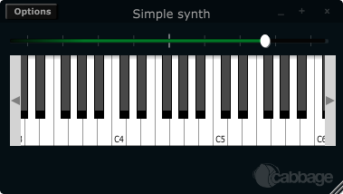

# Controlling your Cabbage instrument
The most obvious limitation to the above instrument is that users cannot interact with the underlying Csound instrument. In order to do this we can use a Csound named channel opcode and a Cabbage widget such as a slider. Any widget that needs to interact with Csound must have a channel identifier. 

When one supplies a channel name to the channel() identifier Csound will listen for data being sent on that channel through the use of a named channel opcode. The chnget opcode is used to grab data from a named channel. It is defined in the Csound reference manual as:

```csharp
kval chnget Sname 
```
'Sname' is the name of the channel. It can be a const string enclosed in inverted commas such as "freq", or it can be a previously defined S type string variable. The same name must be passed to the 'channel()' identifier in the corresponding <Cabbage> section. Our previous example can now be modified so that a slider now controls the volume of our oscillator.

##Example
```html
<Cabbage>
form size(380, 190), caption("Simple synth"), pluginID("plu1")
hslider bounds(5, 5, 370, 30), channel("gain"), range(0, 1, .8)     
keyboard bounds(12, 36, 360, 100)
</Cabbage>
<CsoundSynthesizer>
<CsOptions>
-n -d -+rtmidi=NULL -M0 --midi-key-cps=4 --midi-velocity-amp=5
</CsOptions>
<CsInstruments>
sr = 44100
ksmps = 64
nchnls = 2
0dbfs=1

instr 1
kGain chnget "gain"
a1 oscili p5*kGain, p4, 1
outs a1, a1
endin

</CsInstruments>  
<CsScore>
f1 0 1024 10 1
f0 3600
</CsScore>
</CsoundSynthesizer>
```


In the example above we use a 'hslider' widget, which is a horizontal slider. The bounds() identifier sets up the position and size of the widget on screen. The most important identifier is channel(). It is passed a string called 'gain". This is the same string we pass to 'chnget' in our Csound code. When a user moves the slider, the current position of the slider is sent to Csound on a channel named "gain". The kGain variable is then updated with the value of the slider. Without the channel() identifier no communication would take place between the widget and Csound. The above example also uses a MIDI keyboard that can be used en lieu of a real MIDI keyboard. 
