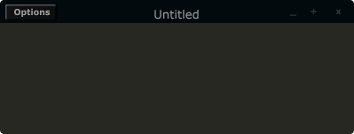

# Form

Form creates the main application window. pluginid() is the only required identifier. The default values for size are 600x300. 

```csharp
form caption("title"), size(Width, Height), pluginid("plug"), \
colour("colour"), guirefresh(val), svgpath("path"), logger(val)
```
<!--(End of syntax)/-->
##Identifiers
**caption** The string passed to caption will be the string that appears on the main application window. 

**size(Width, Height)** integer values denoted the width and height of the form.

**pluginid("plug")** this unique string must be four characters long. It is the ID given to your plugin when loaded by plugin hosts. 

>Every plugin must have a unique plugin ID. If you experience problems loading two different plugins, it could be because they use the same plugin ID. The plugin ID seems to be more relevant when working with OSX than on Linux or Windows.  

**guirefresh(val)** Sets the rate at which Cabbage will update its GUI widgets when controlled by Csound. The value passed represents the number of k-rate cycles to be skipped before the next update. The larger this is the slower the GUI updates will take place, but the less CPU intensive the instrument will be. val should be an integer greater than 1 and is set to ksmps x 2 by default. 

>For best performance one should set guirefresh to be a factor of ksmps.    

**logger(val)** Enables logging of output from Csound. Log will be written to a _Log.txt file in the same directory as the .csd file Cabbage is running. This is disabled by default. Pass it a value of 1 to enable it. 

**colour("colour")** This sets the background colour of the instrument. Any CSS or HTML colour string can be passed to this identifier. The colour identifier can also be passed an RBG value. All channel values must be between 0 and 255. For instance colour(0, 0, 255) will create blue. RGBA values are not permitted when setting colours for your main form. If an RGBA value is set, Cabbage will convert it to RGB. The default colour for form is rgb(5, 15, 20). 

**svgpath("filepath")** Sets the path for any SVG files to be used for drawing widgets. Using this identifier will to save yourself from having to set the svgfile() identifier for each of the widgets. In order to use this identifier you will need to name your SVGs as follows:

- rslider.svg: used to draw the inner circle, and moving part of a rotary slider.
- hslider.svg: used to draw the moving thumb of a vertical slider. 
- vslider.svg: used to draw the moving thumb of a horizontal slider.
- vslider_background.svg: used to draw the background of a vertical slider.
- hslider_background.svg: used to draw the background of a horizontal slider. 
- groupbox.svg: used to draw a custom groupbox widget. 
- buttonon.svg: used to draw a button when on. 
- buttonoff.svg: used to draw a button when off. 

> Theming your instruments can also be done using images, but the advantage of using SVGs is that can they will scale without loss of resolution. You should exercise some caution when using text. If the font you choose if not available on the target platform, it will not be drawn. Also note that unlike shapes and lines, text does not scale well. For more information please see [Using SVGs](./using_svgs.md)


<!--(End of identifiers)/-->

##Example
```csharp
<Cabbage>
form size(400, 500), caption("Untitled"), pluginID("plu1"), colour(39, 40, 34)
</Cabbage>
```

