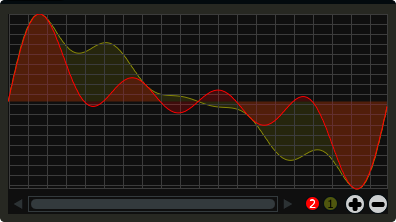

# GenTable

Gentable displays the contents of a function table, multiple tables, or files. Function tables that have their identifier active() set to one, and use a negative GEN05, GEN07 or GEN02 can be edited by clicking and dragging on the table. Only tables of size less or equal to 16384 points can be manually edited. If you wish to save any tables that you create you can use one of Csound's built-in table saving opcode "ftsave". If you need only display the contents of a static sound file from disk, use soundfiler as it will be fast and use less CPU. If on the other hand you wish to create some user editable envelopes, or display FFT or live waveform data use table. 


```csharp
gentable bounds(x, y, width, height), tableNumber(1, 2, ...), \
tablecolour("colour1", "colour2", ...), amprange(min, max, tablenumber, y-quantise),\
tablegridcolour("colour"), tablebackgroundcolour("colour"), samplerange(min, max),\
zoom(val), outlinethickness(val), identchannel("channel"), \
alpha(val), visible(val), scrubberposition(val), \
rotate(radians, pivotx, pivoty), widgetarray("chan", number), active(val)
```
<!--(End of syntax)/-->

##Identifiers
**bounds(x, y, width, height)** Integer values that set position and size on screen(in pixels)

**amprange(min, max, tablenumber, quantise)** Sets the amplitude range(Y-axis) for a particular table. Min and Max are the minimum and maximum values. Quantise will set the resolution of the Y axis for editing. For example, if quantise is set to 1, all points added to the table will be quantised to integer values. If quantise matches the dynamic range of the table, the table will be drawn as a grid of on/off switches. If only one amprange() identifier is used, a table number of -1 can be set so that each table displayed will share the same amp range.

>If the table is not active this identifier can usually be left out. If it is active, and therefore editable, it is important to use this identifier. Failure to do so may cause unexpected result.   

**tablenumber(1, 2, ..)** Sets the table/tables to be displayed. If multiple tables are specified the tables will be superimposed on top of each other. If multiple tables are specified with a colon between then the tables will be stacked on top of each other along the Y-axis, e.g., tablenumber(1:2:3:4).  

**tablebackgroundcolour("colour")** This sets the global background colour. Any CSS or HTML colour string can be passed to this identifier. The colour identifier can also be passed an RBG, or RGBA value. All channel values must be between 0 and 255. For instance colour(0, 0, 255) will create a blue, while colour(0, 255, 0, 255) will create a green with an alpha channel set to full. 

>The default value for the background colour is rgb(10, 10, 10). If you are superimposing tables on top of each other only one can be seen at any time when using the default background colour. If you wish to show all tables at the same time use a colour with an alpha value. Tables  with no alpha channels are drawn faster and use less CPU.  

**tablegridcolour("colour")** Sets the colour of the grid to be drawn. If you don't want a grid to be drawn set this colour to transparent, i.e., 0,0,0,0. See above for details on valid colours.

**tablecolour("colour1", "colour2", ...)** Sets the colour of the table. If you leave this identifier out default colours will be chosen for the tables. If the table size is equal or less than two, the colours passed to tablecolour() will form a gradient fill or three colours.  
>The tablecolour() identifier will not work with RGBA/RGB values. You must instead use a valid CSS colour name. 

**file("filename")** Sets a file for the table to display. Unlike the tablenumber() identifier, which depends on the existence of a valid function table, file() will simply display a file from disk. This can be useful if you are using one of Csound's file reading opcodes. File are always shown as table 0, and will always be the first table created. Therefore it will always take the first colour passed to the tablecolour list. If you wish to load a file after the gentable widget has been created you will need to pass a dummy filename to file() so that the underlying table gets created. If not, calling the file() identifier with an identchannel() will not work.  
>The background grid is disabled when working with a table that use the file() identifier. 

**scrubberposition(val, tableNum)** Sets the scrubber position in samples, from the start of the file. Only valid when displaying a sound file or a GEN01 table. tableNum will determine which table the scrubber will be placed on. If you wish to display a scrubber with other table types(non GEN01) use an image and an identchannel. See the GridSequencer instrument as an example.

**samplerange(min, max)** Set the initial range of the samples. For example, samplerange(0, 255) will cause the gentable widget to display only the first 255 samples from a given table. 

**zoom(val)** Sets the initial zoom value. Passing a -1 to zoom will cause the zoom buttons to disappear.  

**outlinethickness(val)** Sets the thickness of the waveform's envelope in pixels. If you are drawing spectrograms setting this to 0 will speed up the process and reduce CPU drain. 

**fill(val)** This will turn on or off the waveform fill. By default this is set to 1, therefore all table will fill in their envelopes.

**identchannel("channel")** Sets the channel which messages from Csound are sent to the widget on. When used with a chnset opcode users can override widget attributes. See [Identifier channels](./identchannels.md) 

**alpha(val)** A value between 0 and 1 will set the alpha blend value for the entire component. Can be useful if you need to fade widgets in and out. 

**visible(val)** A value of 0 will cause the widget to become invisible. Widgets have their visibility set to 1 by default

**rotate(radians, pivotx, pivoty)** Rotates the widget by a number of radians(2xPI=full rotation). pivotx and pivoty will determine the rotation pivot points, where 0, 0 represents the component's top-left position. 

**widgetarray("chan", number)** Creates an number of widgets in a single pass. See [Widget arrays](./widget_arrays.md)

**active(val)** Set to 0 by default. Will enable or disable on-screen editing of the table. Note that tables must use a negative GEN 02, 05, or 07 in order for manual editing to work. 

<!--(End of identifiers)/-->

>If you need to redraw tables quickly, make sure they don't use negative GEN routines as it will seriously slow down redrawing. 

##Example

```csharp
<Cabbage>
form size(400, 500), caption("Untitled"), pluginID("plu1"), colour(39, 40, 34)
gentable bounds(10, 10, 380, 200), tablenumber(1, 2), tablecolour("yellow", "red"), tablegridcolour(60, 60,60)
</Cabbage>
```
