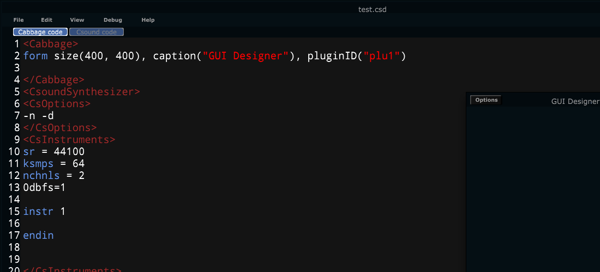

# The GUI Designer
Users can enable the GUI designer by entering "Edit-mode" once an instrument has been started. With edit mode enabled new widgets can be inserted by right-clicking on the instrument's main form and choosing the relevant widget to insert. 

Once a widget has been placed onto the form, a list of identifier properties will appear to the right of the editor. Identifiers can be modified by clicking on the appropriate property box. Hitting the *Return* key on the keyboard will update the widget and update the Cabbage code. When working with multi-line properties, hit the *Tab* key. Clicking on a widget will also highlight the current widget's Cabbage code.    

Multiple widgets can be selected by dragging over them. Once selected they can be moved around the screen, but they can't be resized in a single move. To do this one must group the widgets into [Plants](./plants.md). Once the widgets have been grouped as a plant, they can be resized by dragging the corner of the plant. The newly created plant can also be added to the code repository by highlighting the relevant code in the editor, right-clicking and selecting the 'Add to code repository' command. Saved code blocks can be editing in the Settings dialogue. 

 
