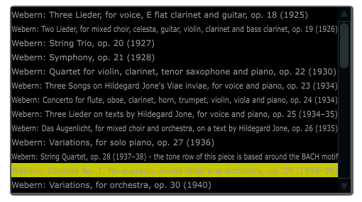

# List box

Listbox creates a list of custom items. Similary to a combobox in functionality, listboxes can be used for much longer lists that users can scroll through. Double-clicking on a listbox item will send a channel message to Csound. 


```csharp
listbox bounds(x, y, width, height), channel("chan"), highlightcolour("colour") \
value(val), items("item1", "item2", ...), populate("filetype", "dir"),\
channeltype("type"), colour("colour"), fontcolour("colour"), align("position"), \
identchannel("channel"), alpha(val), file("filename.txt"), visible(val), caption("caption"), \
rotate(radians, pivotx, pivoty), widgetarray("chan", number), popuptext("text") \
active(val)
```
<!--(End of syntax)/-->

## Identifiers
**bounds(x, y, width, height)** integer values that set position and size on screen(in pixels).

**channel("chan")** "chan" is the name of the channel that Cabbage will communicate with Csound on. The current value of this widget can be retrieved in Csound using a chnget opcode, or can be set using a chnset opcode. Double clicking an item in the listbox will cause a channel message to be sent to Csound. 

**items("item1", "item2", ...)** list of items that will populate the listbox. Each item has a corresponding index value. The first item when selected will send a 1, the second item a 2, the third a 3 etc. If this identifier is left out default values of "Item 1", "Item  2", "Item  3", "Item 4" and "Item 5" will be used.  

**file("filename")** Using this identifier will cause Cabbage to load lines from the given file into the combo box. If a full file path is not given, file() will search  in the current directory, i.e., the directory that contains the csd file that is open. It is best to keep all files in the same directory as your csd file, but if you wish to keep them in a sperate folder you can pass a full path to the file() identifier. 

**value(val)** val sets the initial state of the widget
  
**populate("filetype", "dir")** This will auto-populate the combobox with a set of files from a given directory. Users should specify the file type and the directory to look in. If using a combobox to recall previously recorded preset snapshots you must specify a filetype of "\*.snaps". When using the populate() identifier you do not need to use the items() identifier. If no directory is specified, Cabbage will look in the current working directory. See [Presets](./presets.md)
  
**caption("caption")** This identifier lets you place your widget within a groupbox. "caption" is the text that will appear on groupbox. This identifier is useful for naming and containing widgets.  

**channeltype("type")** Specifies the type of channel. Default is "float". If you wish to send the text contained in the combobox, for examples the names of a set of audio samples, set type to "string". If type is not set to string the index of the selected item will be sent to Csound on the named channel. 

**colour("colour")** This sets the background colour of the listbox. Any CSS or HTML colour string can be passed to this identifier. The colour identifier can also be passed an RBG, or RGBA value. All channel values must be between 0 and 255. For instance colour(0, 0, 255) will create a blue, while colour(0, 255, 0, 255) will create a green with an alpha channel set to full.  

**fontcolour("colour")** Sets the colour of the text and arrow that appear on the combobox. See above for details on valid colours.

**highlightcolour("colour")** Sets the colour of the selected text. See above for details on valid colours.

**identchannel("channel")** Sets the channel which messages from Csound are sent to the widget on. When used with a chnset opcode users can override widget attributes. See [Identifier channels](./identchannels.md)  

**alpha(val)** A value between 0 and 1 will set the alpha blend value for the entire component. Can be useful if you need to fade widgets in and out. 

**align("position")** Aligns the widget's text. "position" should be 'left', 'right' or 'centre'. 

**visible(val)** A value of 0 will cause the widget to become invisible. Widgets have their visibility set to 1 by default. 

**rotate(radians, pivotx, pivoty)** Rotates the widget by a number of radians(2xPI=full rotation). pivotx and pivoty will determine the rotation pivot points, where 0, 0 represents the component's top-left position. 

**widgetarray("chan", number)** Creates an number of widgets in a single pass. See [Widget arrays](./widget_arrays.md)

**popuptext("text")** Displays a popup text box when a user hovers over the widget.

**active(val)** Will deactivate a control if 0 is passed. Controls which are deactivate can still be updated from Csound.

<!--(End of identifiers)/-->

##Example
```csharp
<Cabbage>
form size(400, 500), caption("Untitled"), pluginID("plu1"), colour(39, 40, 34)
listbox bounds(10, 16, 300, 200), channel("comps"), file("Compositions.txt"), colour("yellow"), fontcolour("black")
</Cabbage>
```

