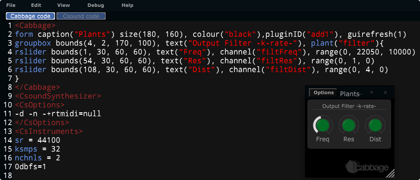

# Plants

Cabbage plants are GUI abstractions that contain one or more controls. These abstractions are used as anchors to the child widgets contained within. All widgets contained within a plant have top and left positions which are relative the the top left position of the parent. Resizing the plant will in turn resize all the widgets contained within. While all widgets can be children of a plant, only group boxes and images can be used as plants themselves. Adding a plant identifier to an image or group box definition will cause them to act as containers. 

> Note that images and groupboxes should not be placed within a plant. Doing so can causes unwanting behaviour.  

The plant() identifier takes a string that denotes the name of the plant. Plant names must be unique within an instrument or plants will end up being placed on top of each other. When using an image or a group box as a plant, you must enclose the code from the widgets that follow in curly brackets to indicate which controls belong to the plant. In the code below a group box control is set up as a plant, and three child sliders are placed within it.

The values passed to bounds() for the child controls are absolute pixel values, from the top left of the parent component. For example, **bounds(10, 10, 50, 50)** will cause a child widget to appear half way across the plant, and half way down. While **bounds(10, 10, 200, 200)** will cause the child control to be 10 pixels from the top/left, and have a size of 200x200 pixels.   
The major advantage to using plant abstractions is that you can easily move and resize them without needing to modify the dimensions of the child widgets contained within. You can also save your plants and recall them later from a plant repository. Plants are intended to be reused across instruments so users do not have to keep rebuilding GUIs from scratch. They can also be used to give your plugins a unique look and feel. 