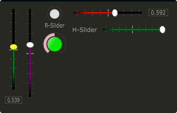

# Sliders

Slider can be used to create an on-screen slider. Data can be sent to Csound on the channel specified through the channel string. Sliders can be rotary, vertical or horizontal, and can react in both a linear and non-linear fashion. 


```csharp
hslider bounds(x, y, width, height), channel("chan"), \
text("name"), textbox(val), range(min, max, value, skew, incr), \
min(val), max(val), textcolour("colour"), fontcolour("colour"), \
trackercolour("colour"), outlinecolour("colour"), trackerthickness(val)
identchannel("channel"), alpha(val), visible(val), caption("caption"), \
rotate(radians, pivotx, pivoty), widgetarray("chan", number), popuptext("text") \
active(val), svgfile("type", "file"), velocity(val)
```
<!--(End of syntax)/-->

##Identifiers
**bounds(x, y, width, height)** integer values that set position and size on screen(in pixels). 

**channel("chan")** "chan" is the name of the channel that Cabbage will communicate with Csound on. The current value of this widget can be retrieved in Csound using a chnget opcode, or can be set using a chnset opcode. If you are using a hslider2 or vslider2 widget you will need to pass two channel names, e.g., channel("sliderMin", "slidermax"), as the slider will be sending data over two channels. 

**range(min, max, value, skew, incr)** the first 2 parameters are required. The rest are optional. The first two parameters let you set the minimum value and the maximum value. The next parameter determines the initial value of the slider. If you are using slider with 2 thumbs, you must pass two values here separated by a colon. For example, if you are using a hslider2, your range() identifiers might read range(0, 100, 20:60, 1, .1). The next allows you to adjust the skew factor. Tweaking the skew factor can cause the slider to output values in a non linear fashion. A skew of 0.5 will cause the slider to output values in an exponential fashion. A skew of 1 is the default value, which causes the slider to behave is a typical linear form. The final parameter sets the incremental step size for the slider. If you need to have very fine control of steps you may wish to look at using an [Endless Encoder](./encoder.md) instead. 

**min(val)** If using a double or triple pointer slider (hslider2, hslider3, vslider2, vslider3), min() will set the default minimum position of the minimum thumb controller. The absolute minimum is set using the range identifier. See above.

**max(val)** If using a double or triple pointer slider (hslider2, hslider3, vslider2, vslider3), max() will set the default maximum position of the maximum thumb controller. The absolute maximum is set using the range identifier. See above. 

**text("name")** The string passed in for "name" will appear on a label beside the slider. This is useful for naming sliders.   

**textbox(on/off)** textbox takes a 0 or a 1. 1 will cause a text box to appear with the sliders values. Leaving this out will result in the numbers appearing automatically when you hover over the sliders with your mouse.

**colour("colour")** This sets the slider. Any CSS or HTML colour string can be passed to this identifier. The colour identifier can also be passed an RBG, or RGBA value. All channel values must be between 0 and 255. For instance colour(0, 0, 255) will create a blue, while colour(0, 255, 0, 255) will create a green with an alpha channel set to full. 

**textcolour("colour")** This set the colour of the text passed to text(). If you wish to change the colour of the numbers being displayed use fontcolour(). See below. See above for details on valid colours. 

**fontcolour("colour")** Sets the colour of the text used to display the slider's value when textbox is enable. See above for details on valid colours. .

**trackercolour("colour")** Sets the colour of the slider's tracker. This is the line that follows the slider when you move it. See above for details on valid colours. To disable the tracker you can set this colour to something with alpha 0, or set the tracker's thickness to 0. 

**trackerthickness(val)** Sets the thickness of the slider's tracker, 1 being full thickness. This is the line that follows the slider when you move it. To disable the tracker you can set its thickness to 0 or it's alpha colour channel to 0. 

**outlinecolour("colour")** Sets the colour of a rotary slider**s tracker outline. This is the line that is drawn around the rslider's tracker. If you don't wish to display the tracker outline set the colour to something with an alpha value of 0. See above for details on valid colours.  

**identchannel("channel")** Sets the channel which messages from Csound are sent to the widget on. When used with a chnset opcode users can override widget attributes. See [Identifier channels](./identchannels.md) 

**alpha(val)** A value between 0 and 1 will set the alpha blend value for the entire component. Can be useful if you need to fade widgets in and out. 

**visible(val)** A value of 0 will cause the widget to become invisible. Widgets have their visibility set to 1 by default. 

**caption("caption")** This identifier will place the widget within a groupbox. "caption" is the text that will appear on group box. This identifier is included for legacy purposes only. It is recommended that you use use your own groupbox component as it will give you far more control over how everything appears on your instrument. 

**rotate(radians, pivotx, pivoty)** Rotates the widget by a number of radians(2xPI=full rotation). pivotx and pivoty will determine the rotation pivot points, where 0, 0 represents the component's top-left position. 

**widgetarray("chan", number)** Creates an number of widgets in a single pass. See [Widget arrays](./widget_arrays.md)

**svgfile("type", "file")** Use this identifier to pass a unique svg file to use instead of the default look and feel. "type" should be one of the following:

- "background" : sets the slider background image
- "slider" : sets the slider thumb, or in the case of a rotary slider, the inner circle. This image moves in sympathy with that the mouse as users move the slider.

For more information see [Using SVGs](./using_svgs.md)

**popuptext("text")** Sets the text that will appear in the popup text bubble when a user hovers over the widget. This can be used to override the defaul text which displays the channel name and the current value. Passing a 0 will disable all popuptext notices completely.  

**active(val)** Will deactivate a control if 0 is passed. Controls which are deactivate can still be updated from Csound.

**velocity(val)** Sets the sensitivity of the slider to mouse movement. The value passed should be in the range of 1 upwards. Note that velocity mode will only work if the range of the slider is greater than the distance in pixels between min and max. 

<!--(End of identifiers)/-->

##Slider types:

* *rslider*, a standard rotary or knob slider

* *hslider*, a standard horizontal slider

* *vslider*, a standard vertical slider

* *hslider2*, two value horizontal range slider (**deprecated, use hrange**)

* *vslider2*, two value vertical range slider (**deprecated, use vrange**)


>Make sure to use two unique channel names when using hslider2 and vslider2, otherwise min and max will be set to the same value. 

##Example

```csharp
<Cabbage>
form size(400, 500), caption("Untitled"), pluginID("plu1"), colour(39, 40, 34)
vslider bounds(12, 8, 35, 200), channel("vslider1"), range(0, 1, .6), colour("yellow"), textbox(1)
vslider bounds(48, 8, 30, 200), channel("vslider2"), range(0, 1, .6), trackercolour("purple")
rslider bounds(88, 8, 50, 50), text("R-Slider"), channel("rslider1"), range(0, 1, 0)
rslider bounds(88, 62, 50, 50), channel("rslider2"), range(0, 1, .5), colour("lime"), trackercolour("pink")
hslider bounds(144, 8, 200, 30), channel("hslider1"), range(0, 1, .2), trackercolour("red"), textbox(1)
hslider bounds(144, 42, 200, 30), text("H-Slider"), channel("hslider2"), range(0, 1, 1)
</Cabbage>
```


