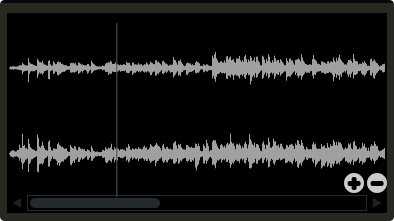

# Soundfiler

Soundfiler will display the contents of a sound file, or a function table containing a sound file (GEN01 tables). This is a fast waveform viewer that allows users to select regions of the waveform. Unlike the table widget, soundfiler can only display one waveform at a time. 


```csharp
soundfiler bounds(x, y, width, height), channel("start", "end"), \
colour("colour1"), zoom(val), tablenumber(val), file("filename"), \
scrubberpos(val), identchannel("channel"), alpha(val), visible(val), \
rotate(radians, pivotx, pivoty), widgetarray("chan", number), active(val)
```
<!--(End of syntax)/-->

##Identifiers
**bounds(x, y, width, height)** Integer values that set position and size on screen(in pixels)

**tablenumber(val)** Sets the table/tables to be displayed. If multiple tables are specified the tables will be superimposed on top of each other. If multiple tables are specified with a colon between then the tables will be stacked on top of each other along the Y-axis, e.g., tablenumber(1:2:3:4).  

**channel("start", "end")** The soundfiler widget takes two channel parameters which relate to the currently selected region. The first channel will provide the starting position, in samples, of the selected region. The second channel will be the end position, in samples. 

**scrubberpos(val)** Sets the scrubber position where val is an integer value in samples. If you wish to update the scrubberposition in real time use an identchannel identifier.

**colour("colour")** This sets the global background colour. Any CSS or HTML colour string can be passed to this identifier. The colour identifier can also be passed an RBG, or RGBA value. All channel values must be between 0 and 255. For instance colour(0, 0, 255) will create a blue, while colour(0, 255, 0, 255) will create a green with an alpha channel set to full. 

**file("filename")** Sets a file for the table to display. Unlike the tablenumber() identifier, which depends on the existence of a valid function table, file() will simply display a file from disk. This can be useful if you are using one of Csound's file reading opcodes. If a full file path is not given, file() will search  in the current directory, i.e., the directory that contains the csd file that is open. It is best to keep all files in the same directory as your csd file, but if you wish to keep them in a sperate folder you can pass a full path to the file() identifier. 

**zoom(val)** Sets the initial zoom value. Passing a -1 to zoom will cause the zoom buttons to disappear.  

**identchannel("channel")** Sets the channel which messages from Csound are sent to the widget on. When used with a chnset opcode users can override widget attributes. See [Identifier channels](./identchannels.md) 

**alpha(val)** A value between 0 and 1 will set the alpha blend value for the entire component. Can be useful if you need to fade widgets in and out. 

**visible(val)** A value of 0 will cause the widget to become invisible. Widgets have their visibility set to 1 by default

**rotate(radians, pivotx, pivoty)** Rotates the widget by a number of radians(2xPI=full rotation). pivotx and pivoty will determine the rotation pivot points, where 0, 0 represents the component's top-left position. 

**widgetarray("chan", number)** Creates an number of widgets in a single pass. See [Widget arrays](./widget_arrays.md)

**active(val)** Will deactivate a control if 0 is passed. Controls which are deactivate can still be updated from Csound.

<!--(End of identifiers)/-->

##Example

```csharp
<Cabbage>
form size(400, 500), caption("Untitled"), pluginID("plu1"), colour(39, 40, 34)
soundfiler bounds(10,10, 380, 200), file("/home/rory/JazzStems/06_Piano.wav")
</Cabbage>
```
