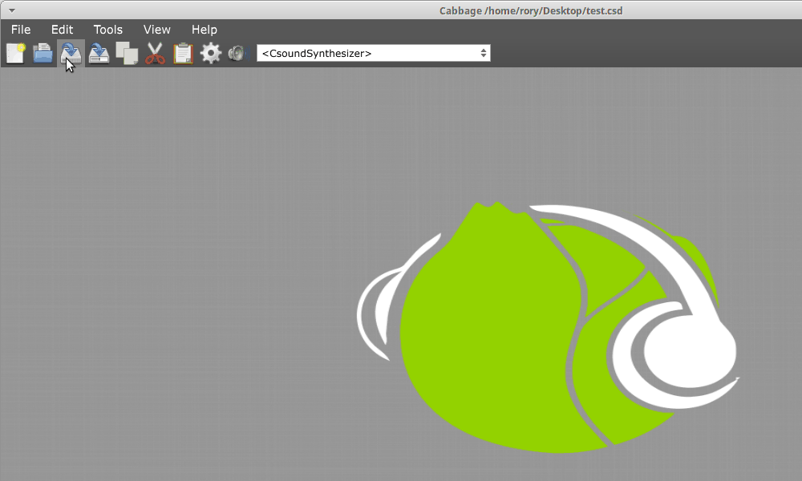
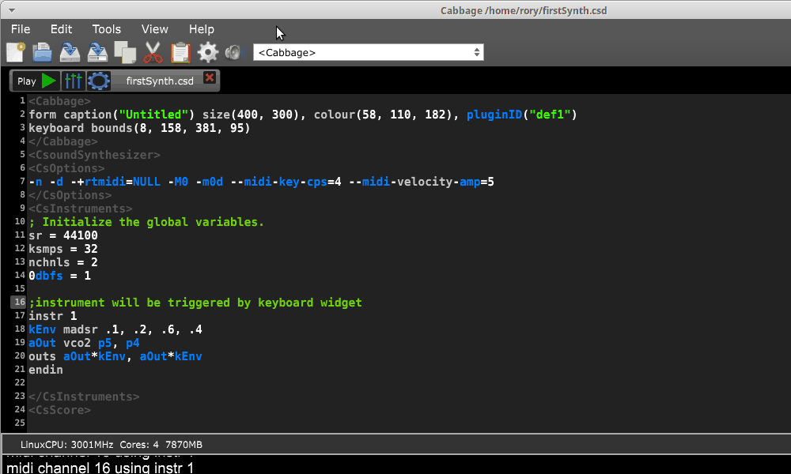
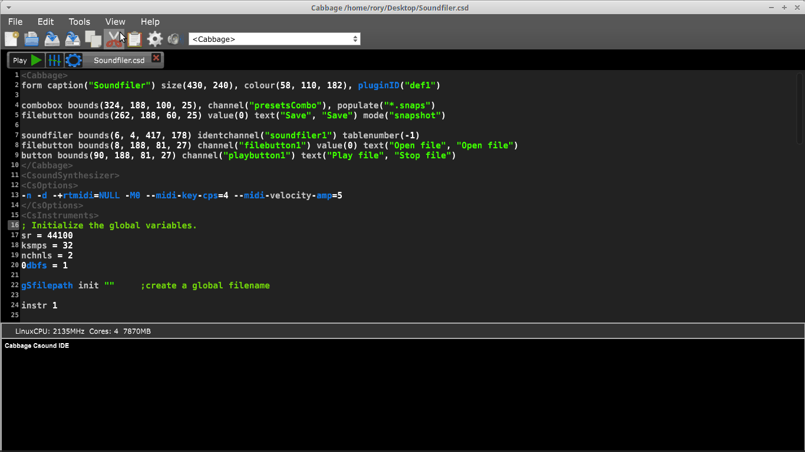
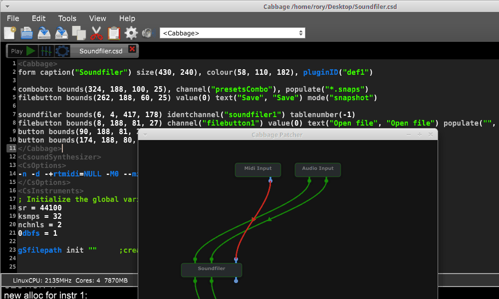
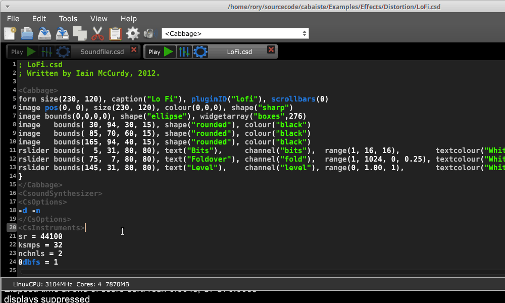
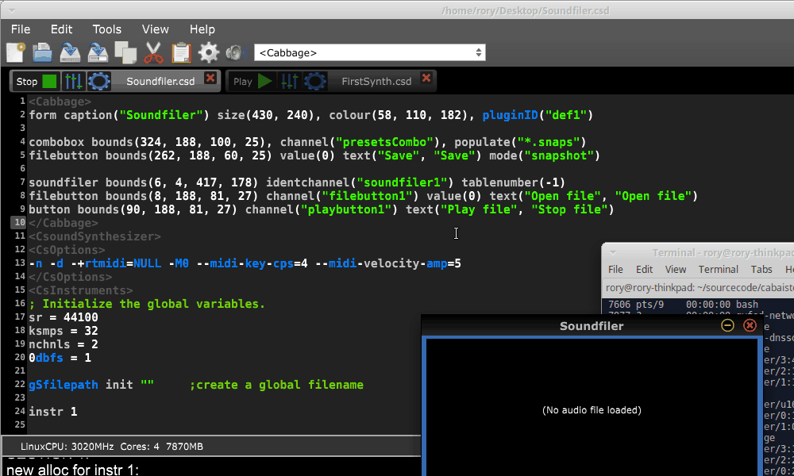
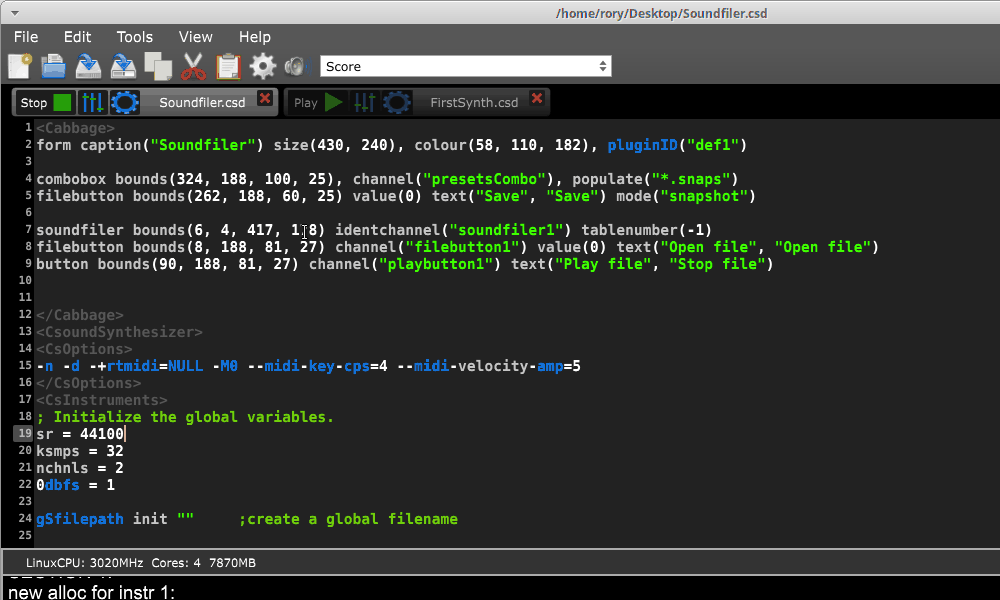

# Using Cabbage

Instrument development and prototyping is carried out with the main Cabbage IDE. Users write and compile their Csound code in a code editor. Each Csound file opened with have a corresponding editor. If one wishes one can also create a graphical frontend, although this is no longer a requirement for Cabbage. Any Csound file can be run with Cabbage, regardless of whether or not it has a graphical interface. Each Csound files that is compiled by Cabbage will be added to an underlying digital audio graph. Through this graph users can manage and configure instrument to create patches of complex processing chains. 

##Opening files
User can open any .csd files by clicking on the Open File menu command, or toolbar button. Users can also browse the Examples menu from the main File menu. Cabbage ships with over 100 high-end instruments that can be modified, hacked, and adapted in any way you wish. Note that if you wish to modify the examples, use the Save-as option first. Although this is only required on Windows, it's a good habit to form. You don't want to constantly overwrite the examples with your own code. 
>Cabbage can load and perform non-Cabbage score-driven .csd files. However, it also uses its own audio IO, so it will overwrite any -odac options set in the CsOptions section of a .csd file. 

##Creating a new file
News files can be created by clicking the New file button in the toolbar, or by clicking File->New Csound file from the main menu. When a new file is requested, Cabbage will give you the choice of 3 basic templates, as shown below. 

The choices are:
- A new synth. When this option is selected Cabbage will generate a simple synthesiser with an ADSR envelope and MIDI keyboard widget. In the world of VST, these instruments are referred to a VSTi's. 
- A new effect. When this option is selected Cabbage will create a simple audio effect. It will generate a simple Csound instrument that provides access to an incoming audio stream. It also generates code that will control the gain of the output.  
- A new Csound file. This will generate a basic Csound file without any graphical frontend. 

>Note that these templates are provided for quickly creating new instruments. One can modify any of the template code to convert it from a synth to an effect or vice versa. 

##Building/compiling instruments
To run an instrument users can use the controls at the top of the file's editor. Alternatively one can go to the Tools menu and hit Build Instrument. 

>Closing a file will not stop it from performing. To stop a file from performing you must hit the Stop button.  

##Creating GUI interfaces for instruments
To create a GUI for your instrument you must enter edit mode for that instrument. you can do this by hitting the Edit mode button at the top of the file's editor, or by hitting Ctrl+e when the editor for that instrument have focus. Once in edit mode, each widget will have a thin white border around it. you can move widgets around whilst in edit. You can also right-click and insert new widgets, as well as modify their appearance using the GUI properties editor on the right-hand side of the screen. 

You will notice that when you select a widget whilst in edit mode, Cabbage will highlight the corresponding line of text in your source code. When updating GUI properties, hit 'Enter' when you are editing single line text or numeric properties, 'Tab' when you are editing multi-line text properties, and 'Escape' when you are editing colours. 

##Editing the audio graph
Each and every instrument that you compile in Cabbage will be added to an underlying audio graph. This is true for both Cabbage files, and traditional Csound files. To edit the graph one can launch the Cabbage patcher from the view menu. 

Instruments can also be added directly through the graph by right-clicking and adding them from the context menu. The context menu will show all the examples files, along with a selection of files from a user-defined folder. See the section below on *Settings* to learn how to set this folder. 

Instruments can also be deleted by right-clicking the instrument node. Users can deleted/modify connections by clicking on the connections themselves. They can also connect node by clicking and dragging from an output to an input.
 
Once an instrument node has been added, Cabbage will automatically open the corresponding code. Each time you update the corresponding source code, the node will also be updated. 
>As mentioned above, closing a file will not stop it from performing. It is possible to have many instruments running even though their code is not showing. To stop an instrument you must hit the Stop button at the top of its editor, or delete the plugin from the graph.

##Navigating large source files
It can become quite tricky to navigate very long text files. For this reason Cabbage provides a means of quickly jumping to instrument definitions. It is also possible to create a special `;- Region:` tag. Any text that appears after this tag will be appended to the drop-down combo box in the Cabbage tool bar.
 

##Using the code repository
Cabbage provides a quick way of saving and recalling blocks of code. To save code to the repository simple select the code you want, right-click and hit 'Add to code repository'. To insert code later from the repository, right-click the place you wish to insert the code and hit 'Add from code repository'.

Code can be modified, edited or deleted at a later stage in the Settings dialogue. 

## Audio Settings
Clicking on the audio settings command will open the audio settings window. Here you can choose your audio/MIDI input/output devices. You can also select the sampling rate and audio buffer sizes. Small buffer sizes will reduce latency but might cause some clicks in the audio. 

## Toggle edit-mode
Enabling edit-mode allows users to interact with GUI widgets. When in edit-mode, right clicking on the instrument's main area will display a context menu that will let you select a widget to insert on to your main form. When a widget is placed on screen the corresponding code will be inserted into your instrument's code. Any changes you make to the widget's size and position will automatically be updated in your code. Toggling edit-mode will also cause a property dialogue to appear. Any widget property can be set using this property dialogue window. In order to update your underlying source code with a newly edited property you must hit the 'Esc' key on your keyboard. If you do not, your updated property will not be passed to the instrument's source code and will therefore be discarded.  

> One should get into the habit of updating/saving their instruments when they make changes to its user interface. Instruments need to be recompiled for any changes to stick.   

## Export/Export as...

This command will export your Cabbage instrument as a plugin, that is, it will create a new plugin library file along with a copy of the Csound text file. Clicking 'synth' or 'effect' will cause Cabbage to create a plugin file in the same directory as the .csd file you are currently using. When 'exporting as...' Cabbage will prompt you to save your plugin in a set location, under a specific name. Once Cabbage has created the plugin it will make a copy of the current .csd file and locate it in the same folder as the plugin. This new .csd file will have the same name as the plugin and should ALWAYS be in the same directory as the plugin file. 

> You do not need to keep exporting instruments as plugins every time you modify them. You need only modify the associated .csd file. To simplify this task, Cabbage will automatically load the associated .csd file whenever you export as a plugin. On OSX Cabbage can open a plugin's .csd file directly be selecting the plugin when prompted to select a file to open. 

## Reload Instrument
This command will hard reset and rebuild the instrument from disk. 

## Batch Convert 
Batch convert will let convert a selection of Cabbage .csd files, or an entire directory into plugins so you don't have to manually open and export each one.  

> Currently this feature is only available on Windows.

## Preferences
The following preferences are available:

## Always on Top
This command lets you toggle 'Always on top' mode. By default it is turned on. This means your Cabbage instrument will always appear on top of any other applications that are currently open. 

## Set Cabbage plant directory
This will open a directory browser dialog so that you can specify a set directory for saving Cabbage plant text files to. The default location for these files will be the user's home folder and should be left as is unless a unique location is absolutely required. 

## Set Csound manual directory
This will open a directory browser dialog so that you can specify the directory that contains Csound's index.html file. Once this directory is set you can launch context help for any Csound opcode that the text cursor is currently placed on. 

## Disable plugin export info
Checking this will disable the plugin export information that pops up on screen each time you export a plugin. 

## Use external editor
If you wish to use a different source code editor with Cabbage than the one provided, you can check this option. Whenever you save changes to the .csd file that Cabbage currently has open, Cabbage will automatically update according to the changes made. Although it's not as quick as the integrated editor, it does give you scope to use some feature rich source code editors with Cabbage.   
## Use native file dialogues

This option lets you set whether Cabbage will use its own File Chooser dialogues, or those provided by the operating system. Due to various issues with Linux file managers, Linux users may want to ensure that they use non-native dialogues. All file choosers that launch from within a Cabbage instrument will use non-native dialogues. 