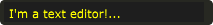

# Text Editor

Texteditor creates a single line text editor that can be used to send strings to Csound. Hitting return when in single line mode will send the string to Csound on a named string channel while pressing the up and down buttons when the texteditor is in focus will toggle through the previous strings that have been sent. When in "multiline" mode, press command and return to send the string data to Csound. 

```csharp
texteditor bounds(x, y, width, height), channel("channel"), \
text("text"), colour("colour"), fontcolour("colour"), alpha(val), mode("mode")\
visible(val), rotate(radians, pivotx, pivoty), widgetarray("chan", number) \ popuptext("text"), active(val)
```
<!--(End of syntax)/-->

##Identifiers

**bounds(x, y, width, height)** integer values that set position and size on screen(in pixels)

**channel("chan")** "chan" is the name of the channel that Cabbage will communicate with Csound on. The current value of this widget can be retrieved in Csound using a chnget opcode, or can be set using a chnset opcode. 

**colour("colour")** This sets the colour of the image if a file name is not passed to file. Any CSS or HTML colour string can be passed to this identifier. The colour identifier can also be passed an RBG, or RGBA value. All channel values must be between 0 and 255. For instance colour(0, 0, 255) will create a blue, while colour(0, 255, 0, 255) will create a green with an alpha channel set to full.  

**fontcolour("colour")** Sets the colour of the text that appears with the slider. See above for details on valid colours.

**identchannel("channel")** Sets the channel which messages from Csound are sent to the widget on. When used with a chnset opcode users can override widget attributes. See [Identifier channels](./identchannels.md) 

**alpha(val)** A value between 0 and 1 will set the alpha blend value for the entire component. Can be useful if you need to fade widgets in and out. 

**visible(val)** A value of 0 will cause the widget to become invisible. Widgets have their visibility set to 1 by default. 

**rotate(radians, pivotx, pivoty)** Rotates the widget by a number of radians(2xPI=full rotation). pivotx and pivoty will determine the rotation pivot points, where 0, 0 represents the component's top-left position. 

**widgetarray("chan", number)** Creates an number of widgets in a single pass. See [Widget arrays](./widget_arrays.md)

**popuptext("text")** Displays a popup text box when a user hovers over the widget.

**active(val)** Will deactivate a control if 0 is passed. Controls which are deactivate can still be updated from Csound.

**mode("mode")** Set the number of lines. Use "mutli" for a multiline texteditor. Defaults to "single".
<!--(End of identifiers)/-->

##Example

<Cabbage>
form size(400, 500), caption("Untitled"), pluginID("plu1"), colour(39, 40, 34)
texteditor bounds(10, 10, 200, 20), colour(30, 30, 30), fontcolour("yellow"), text("I'm a text editor!...")
</Cabbage>

