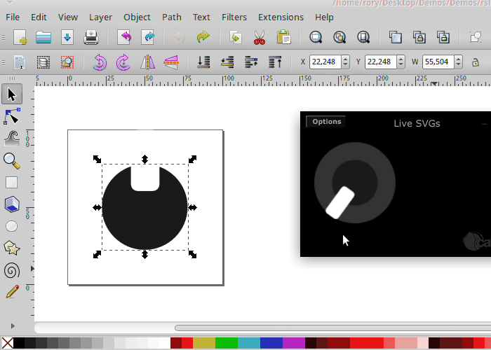

# Using SVGs

Cabbage widgets can be drawn using Scalable Vector Graphics such as the .svg files created using software such as Inkscape, or Adobe Illustrator. Doing so can give you further control over how your instrument looks, and can help you create unique and original look and feels for your instruments. While SVGs may not provide the same level of detail as PNG files, they are scalable without any loss of data. This reduces the need to provide several copies of a single image at various sizes and resolutions. This also means your SVGs can easily be used on a range of instruments without having to be modified.  

> Note that the SVG parser does not support the entire SVG specification. Basic shapes/lines are rendered perfectly. Text is rendered, but you may need to tweak the dimensions. Careful that your text is not classified as 'flowtext'. Flowtext will not render. Filters are not yet supported.  

### Using a global SVG path
If you wish to use a set of SVG files to replace the drawing of common components, the easiest way to do so is by setting the global SVG path using the svgpath() identifier of your form widget. For example, we could do something like this.

```csharp
<Cabbage>
form caption("SVG Example") size(530, 480), colour("black"), svgpath(".")
(...)
```  
This will cause Cabbage to search the current directory for a set of SVG files that it will be use for drawing common widgets. The files should be named as follows:

- rslider.svg: used to draw the inner circle, and moving part of a rotary slider.
- hslider.svg: used to draw the moving thumb of a vertical slider. 
- vslider.svg: used to draw the moving thumb of a horizontal slider.
- vslider_background.svg: used to draw the background of a vertical slider.
- hslider_background.svg: used to draw the background of a horizontal slider.
- groupbox.svg: used to draw a custom groupbox widget. 
- buttonon.svg: used to draw a button when on. 
- buttonoff.svg: used to draw a button when off.

> Note that check boxes do not support SVG files. SVG check boxes can be built using buttons.

If any of the above files are not found, Cabbage will use the default look and feel instead. Don't worry if your SVG files don't have the same dimensions as your widgets, they will rescale accordingly.   

### Using specific SVG File
Is you wish to use specific SVG file for a certain widget you may do so using its **svgfile()** identifier. Althought it invovles a little more typing, using the **svgfile()** identifier lets you attach a unique SVG file to various widgets of the same type. This cannot be done using the global SVG path. Please refer to the widget reference manual for details on using the **svgfile()** identifier. 

##Example
The example below show how both the **svgpath()** and **svgfile()** identifiers can be used together. 

```csharp
<Cabbage>
form caption("SVG Example") size(530, 480), colour("black"), pluginID("SMo1"), svgpath(".")
 groupbox bounds(122, 4, 376, 135), text("")
 groupbox bounds(120, 152, 379, 277), text(""), svgfile("custom_groupbox.svg"), identchannel("groupbox")
 rslider bounds(18, 90, 90, 90), channel("Waveshape"), range(0, 5, 0, 1, 1), trackercolour("orange"), text("rSlider"), trackercolour(0,0,0,0), trackerthickness(.5)
 rslider bounds(18, 184, 90, 79), channel("rslider"), range(0, 1, 0), trackercolour("darkorange"), trackerthickness(0.4), textbox(1)
 hslider bounds(150, 34, 323, 27), channel("vslider1"), text("Param1"), range(0, 1, .5), trackercolour("orange"), textbox(1), gradient(0), trackerthickness(.2)
 hslider bounds(150, 64, 322, 27), channel("vslider2"), text("Param2"), range(0, 1, .75), trackercolour("orange"), textbox(1), gradient(0), trackerthickness(.2)
 hslider bounds(150, 94, 322, 27), channel("vslider3"), text("Param3"), range(0, 1, .25), trackercolour("orange"), textbox(1), gradient(0), trackerthickness(.2)
 vslider bounds(148, 192, 50, 220), channel("vslider1"), trackercolour("darkorange"), textbox(1), range(0, 1, .4), text("vP.1"), trackerthickness(.125), gradient(0)
 vslider bounds(202, 192, 50, 220), channel("vslider2"), trackercolour("darkorange"), textbox(1), range(0, 1, .24), text("vP.1"), trackerthickness(.125), gradient(0)
 vslider bounds(256, 192, 50, 220), channel("vslider3"), trackercolour("darkorange"), textbox(1), range(0, 1, .64), text("vP.1"), trackerthickness(.125), gradient(0)
 vslider bounds(310, 192, 50, 220), channel("vslider4"), trackercolour("darkorange"), textbox(1), range(0, 1, .34), text("vP.1"), trackerthickness(.125), gradient(0)
 vslider bounds(364, 192, 50, 220), channel("vslider5"), trackercolour("darkorange"), textbox(1), range(0, 1, .14), text("vP.1"), trackerthickness(.125), gradient(0)
 vslider bounds(418, 192, 50, 220), channel("vslider6"), trackercolour("darkorange"), textbox(1), range(0, 1, .4), text("vP.1"), trackerthickness(.125), gradient(0)
 button bounds(20, 6, 85, 35), channel("but1"), text("Disabled", "Enabled"), fontcolour:0("orange")
 button bounds(20, 46, 85, 35), channel("but2"), text("Disabled", "Enabled"), fontcolour:0("orange")
 rslider bounds(18, 264, 90, 90), channel("Waveshape"), range(0, 5, 0, 1, 1), trackercolour("orange"), text("rSlider"), trackercolour(0,0,0,0), trackerthickness(.5)
</Cabbage>  
```


### Debugging and Developing instruments with SVGs

Each widget capable of using SVGs support a special **svgdebug()** identifier. 

- **svgdebug(val)** Each time a new value is passed to to this identifier Cabbage will update the SVG it shows.

This means that with some simple code you can have Cabbage update in real time whenever you make changes to the underlying SVGs. This will dramatically speed up the development of your GUI. Below is a simple example. The slider has an identifier channel associated with it. Using a simple metro object to time the updates, we call **svgdebug()** once every second. As changes are saved in Inkscape, Cabbage will automatically update the widget's appearance on screen. Note, that this should be used for develop purposes only! 

```csharp
<Cabbage>
form caption("Live SVGs") size(330, 180), colour("black"), pluginID("SMo1"), svgpath(".")
rslider bounds(12, 14, 130, 122), channel("rslider"), range(0, 1, 0), identchannel("svgIdent")
</Cabbage>  
<CsoundSynthesizer>
<CsOptions>
-d -n
</CsOptions>
<CsInstruments>
sr 		= 	44100	;SAMPLE RATE
ksmps 		= 	32	;NUMBER OF AUDIO SAMPLES IN EACH CONTROL CYCLE
nchnls 		= 	2	;NUMBER OF CHANNELS (2=STEREO)
0dbfs		=	1

instr	1
if metro(1)==1 then
	kRand random 0, 10000
	chnset sprintfk("svgdebug(%d)", kRand), "svgIdent"
endif
endin
		
</CsInstruments>
<CsScore>
i1 0 [3600*24*7]
</CsScore>
</CsoundSynthesizer>
```



