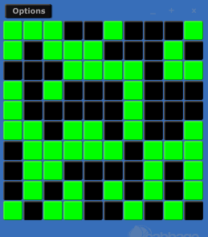

# Quickly creating multiple widgets
If you wish to create a large number of widgets you can use the widgetarray() identifier, which takes a base channel name, and the number of widgets to be created. Each widget channel will have an underscore and number appended to them, e.g., chan_1, chan_2. While each identchannel will have a _ident string and number appended to them, e.g., chan_ident1, chan_ident2, etc. The following code will create 100 checkboxes, all sharing the same position.

```csharp
checkbox bounds(10, 10, 50, 50), channelarray("test", 100), value(1)
```

The first checkbox widget will have a channel named "test1", and an ident-channel named "test_ident1". The second widget channel will be named "test2", while its ident-channel will be named "test_ident2", and so on, upwards to 100. The identifiers for the newly created checkboxes can be modified using Csound code. For example, the following code will place the checkboxes around the screen in a 10x10 grid.

```csharp
<Cabbage>
form size(260, 290), caption(""), pluginID("plu1")
checkbox bounds(-100, -100, 25, 25), text("Push"), widgetarray("test", 100), value(0)
</Cabbage>
<CsoundSynthesizer>
<CsOptions>
-n -d -+rtmidi=NULL -M0 -m0d --midi-key=4
</CsOptions>
<CsInstruments>
sr = 44100
ksmps = 64
nchnls = 2
0dbfs=1
  
instr 1
iCnt init 0
iCntRows init 0
kMetro metro 1
	until iCnt > 100 do
		S1 sprintfk "pos(%d, %d)", iCnt%10*25+5, iCntRows*25
		S2 sprintfk "test_ident%d", iCnt+1
		chnset S1, S2
		iCnt=iCnt+1
		iCntRows = (iCnt%10==0 ? iCntRows+1 : iCntRows)
	enduntil
	if kMetro==1 then
		event "i", 2, 0, .01
	endif		
endin


instr 2
iCnt init 0
until iCnt > 100 do
	S2 sprintfk "test%d", iCnt+1
	iValue random 0, 100
	chnset iValue<50 ? 0 : 1, S2
	iCnt=iCnt+1
	iCntRows = (iCnt%10==0 ? iCntRows+1 : iCntRows)
enduntil
endin

</CsInstruments>  
<CsScore> 
i1 0 1000
</CsScore>
</CsoundSynthesizer> 
```



For more details on how to controls widgets from Csound code look at the [Controlling widgets](./controlling.md) section. 

> Widget arrays don't work with plants!